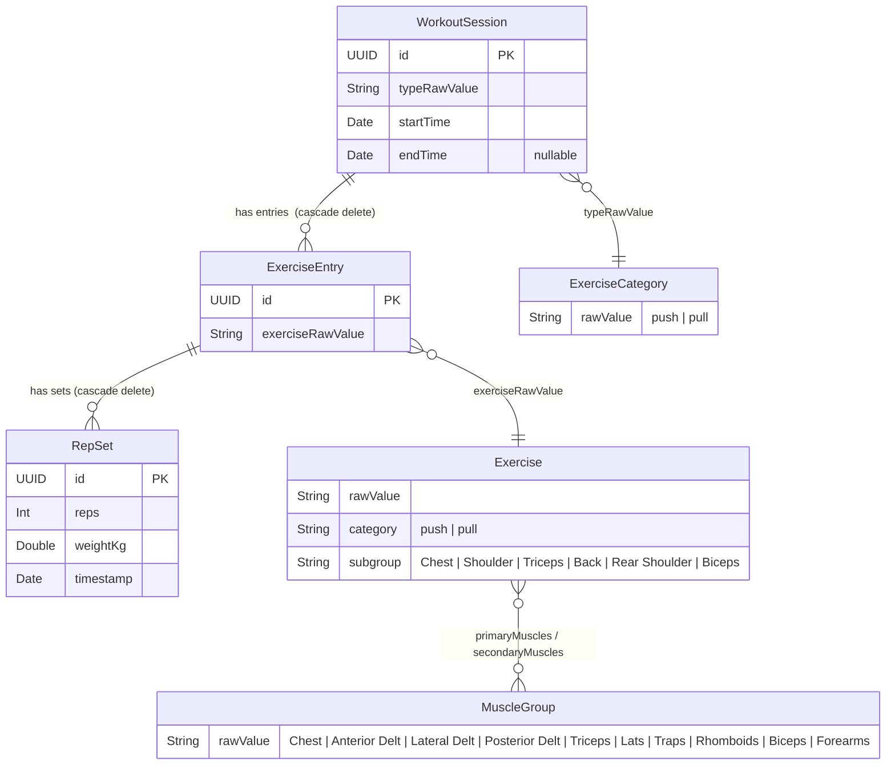

# Hello Coach — Entity Relationship Diagram



---

## Computed Properties

> Derived at runtime — not stored in the database.

| Entity | Property | Formula |
|:---|:---|:---|
| `WorkoutSession` | `type` | `ExerciseCategory(rawValue: typeRawValue)` |
| `WorkoutSession` | `totalReps` | `sum(entries.totalReps)` |
| `WorkoutSession` | `totalVolume` | `sum(entries.totalVolume)` |
| `WorkoutSession` | `totalSets` | `sum(entries.setCount)` |
| `WorkoutSession` | `duration` | `endTime − startTime` |
| `WorkoutSession` | `formattedDuration` | `"m:ss"` |
| `WorkoutSession` | `exerciseSummary` | `entries[].displayName joined` |
| `ExerciseEntry` | `exercise` | `Exercise(rawValue: exerciseRawValue)` |
| `ExerciseEntry` | `totalReps` | `sum(sets.reps)` |
| `ExerciseEntry` | `totalVolume` | `sum(sets.volume)` |
| `ExerciseEntry` | `setCount` | `sets.count` |
| `ExerciseEntry` | `bestSet` | `sets.max(by: volume)` |
| `RepSet` | `volume` | `reps × weightKg` |

---

## Delete Cascade

```
WorkoutSession  →  ExerciseEntry  →  RepSet
   (deleted)           (deleted)      (deleted)
```

Menghapus satu `WorkoutSession` secara otomatis menghapus semua `ExerciseEntry` dan `RepSet` miliknya.

---

## Storage

| Kelas | Tipe | Lokasi |
|:---|:---|:---|
| `WorkoutSession` | `@Model` | SQLite via `ModelContainer` |
| `ExerciseEntry` | `@Model` | SQLite via `ModelContainer` |
| `RepSet` | `@Model` | SQLite via `ModelContainer` |
| `ExerciseCategory` | `enum String` | In-memory (rawValue di model) |
| `Exercise` | `enum String` | In-memory (rawValue di model) |
| `MuscleGroup` | `enum String` | In-memory (computed property) |
